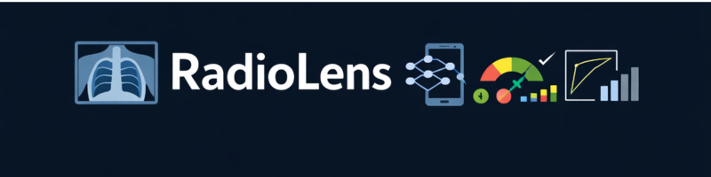
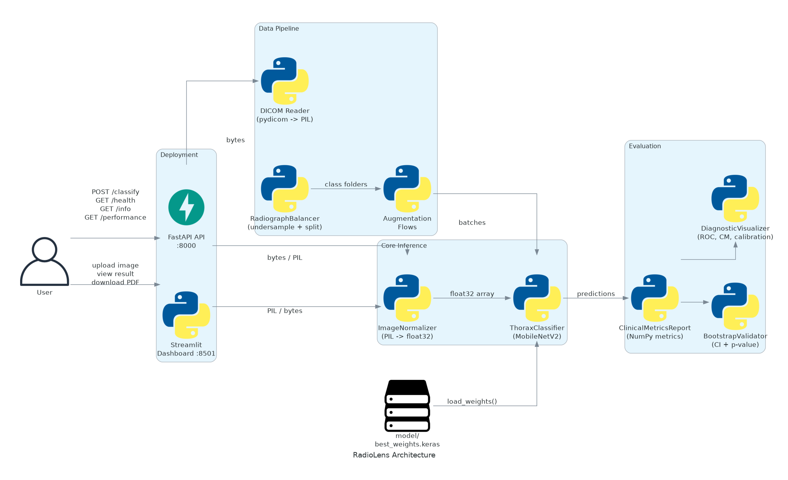

<p align="center"></p>

<h1 align="center">RadioLens</h1>
<p align="center">Clinical-grade chest X-ray pneumonia detection with cross-validated deep learning</p>

<p align="center">
  <a href="LICENSE"></a>
  
  
</p>

---

**Navigation:**
[What It Does](#what-it-does) |
[Architecture](#architecture) |
[Getting Started](#getting-started) |
[Using RadioLens](#using-radiolens) |
[API Reference](#api-reference) |
[CLI Reference](#cli-reference) |
[Configuration](#configuration) |
[Benchmarks](#benchmarks) |
[Design Decisions](#design-decisions) |
[Known Limitations](#known-limitations) |
[Contributing](#contributing) |
[License](#license)

---

## What It Does

RadioLens classifies chest X-ray images as **NORMAL** or **PNEUMONIA** using a MobileNetV2 backbone fine-tuned on the Kaggle Chest X-Ray Images (Pneumonia) dataset. Every prediction includes a raw probability, a confidence score, and a certainty tier (HIGH / MODERATE / LOW) derived from how far the sigmoid output is from the decision boundary.

The system is validated with a stratified internal split (70/20/10) and cross-operator validation on an independent 107-image external dataset. Bootstrap resampling (n=1000) tests whether the AUC difference between the two populations is statistically significant (p=0.978, 95% CI for ΔAUC: [−0.0115, 0.0099]).

> **Research use only.** This system is an experimental AI prototype. Its outputs must not be used as a substitute for professional medical diagnosis.

---

## Architecture

<p align="center"></p>

RadioLens has five distinct layers:

| Layer | Modules | Responsibility |
|---|---|---|
| **API** | `api/` | FastAPI REST server, ASGI middleware, Pydantic contracts, DI providers |
| **Dashboard** | `app/` | Streamlit web UI, file upload, PDF report generation |
| **Core** | `core/` | `ThoraxClassifier` (MobileNetV2 inference), `ImageNormalizer` (preprocessing) |
| **Data** | `data/` | `RadiographBalancer` (undersample + split), augmentation flows, DICOM reader |
| **Evaluation** | `evaluation/` | Pure-NumPy metrics, bootstrap validator, diagnostic plots |

The API and dashboard both use the same `ThoraxClassifier` singleton, which is loaded once during FastAPI's lifespan startup and remains read-only thereafter.

**Inference path:**

```
Raw file (JPEG / PNG / DICOM)
        |
        v
  ImageNormalizer
  - convert to RGB
  - resize to 224x224 (bilinear)
  - scale to [0, 1] float32
        |
        v
  ThoraxClassifier
  - MobileNetV2 backbone (ImageNet weights, frozen)
  - GlobalAveragePooling2D
  - Dropout(0.3) -> Dense(128, relu) -> Dropout(0.2) -> Dense(1, sigmoid)
        |
        v
  InferenceResult
  - label:          PNEUMONIA | NORMAL
  - probability:    raw sigmoid [0, 1]
  - confidence:     max(p, 1-p)
  - certainty_tier: HIGH (>=0.85) | MODERATE (>=0.70) | LOW (<0.70)
```

---

## Getting Started

### Prerequisites

- Python 3.10 or later
- [Docker](https://docs.docker.com/get-docker/) (recommended for the quickest path)
- Trained model weights file (`best_weights.keras` or `best_weights.h5`)

### Obtain model weights

The weights file is not bundled in this repository. Place it at `model/best_weights.keras` relative to the project root before starting either service.

### Option 1 -- Docker Compose (recommended)

```bash
# Clone the repo
git clone <repo-url>
cd radiolens

# Place model weights
mkdir -p model
cp /path/to/best_weights.keras model/

# Start API (port 8000) and dashboard (port 8501)
docker compose -f docker/docker-compose.yml up
```

The API starts first. The dashboard waits until the API health check passes.

### Option 2 -- Local installation

```bash
# Install core + API + dashboard dependencies
pip install -e ".[api,dashboard]"

# Copy and edit environment
cp .env.example .env
# Set RADIOLENS_MODEL_WEIGHTS_PATH if the default (model/best_weights.keras) differs

# Start the API server
radiolens-serve

# In a separate terminal, start the dashboard
streamlit run app/dashboard.py
```

### Development setup

```bash
pip install -e ".[api,dashboard,dev]"
pre-commit install

# Run the fast test suite (excludes GPU-dependent tests)
make test-fast
```

---

## Using RadioLens

### Web dashboard

Open `http://localhost:8501` in a browser. Upload a JPEG, PNG, or DICOM file. The dashboard displays the label, probability, and confidence tier, and lets you download a PDF report.

<!-- TODO: capture screenshots of the dashboard and save as assets/dashboard-upload.png, assets/dashboard-result.png -->

### REST API

Send a multipart POST request to classify an image:

```bash
curl -X POST http://localhost:8000/api/v1/classify \
  -F "file=@chest_xray.jpg"
```

Response:

```json
{
  "label": "PNEUMONIA",
  "probability": 0.9231,
  "confidence": 0.9231,
  "certainty_tier": "HIGH",
  "clinical_note": "RESEARCH USE ONLY. ...",
  "model_version": "0.1.0"
}
```

### Python library

```python
from pathlib import Path
from radiolens.config import get_settings
from radiolens.core.detector import ThoraxClassifier
from radiolens.core.preprocessor import ImageNormalizer

settings = get_settings()
clf = ThoraxClassifier(settings)
clf.load_weights(Path("model/best_weights.keras"))

normalizer = ImageNormalizer(settings)
pixel_array = normalizer.from_path(Path("chest_xray.jpg"))

result = clf.run_inference(pixel_array)
print(result.label, result.confidence, result.certainty_tier)
```

### Training a model from scratch

```bash
# 1. Balance and split raw data (folders: normal/, pneumonia/)
radiolens-prepare --source-dir ./raw --output-dir ./data

# 2. Train
radiolens-train --data-dir ./data --checkpoint-dir ./model

# 3. Evaluate
radiolens-evaluate --model-path ./model/best_weights.keras \
                   --test-dir ./data/test \
                   --output-dir ./results
```

---

## API Reference

Base URL: `http://localhost:8000/api/v1`

Interactive docs: `http://localhost:8000/docs`

### POST /classify

Classify a chest X-ray image.

**Request:** `multipart/form-data`

| Field | Type | Description |
|---|---|---|
| `file` | file | JPEG, PNG, or DICOM image. Max 10 MB by default. |

**Response 200:**

| Field | Type | Description |
|---|---|---|
| `label` | string | `"PNEUMONIA"` or `"NORMAL"` |
| `probability` | float | Raw sigmoid output [0, 1] |
| `confidence` | float | `max(probability, 1 - probability)` |
| `certainty_tier` | string | `"HIGH"`, `"MODERATE"`, or `"LOW"` |
| `clinical_note` | string | Mandatory disclaimer text |
| `model_version` | string | Deployed model semantic version |

**Error responses:**

| Code | Condition |
|---|---|
| 400 | Unsupported file type (not `.jpeg`, `.jpg`, `.png`, `.dcm`) |
| 413 | File exceeds `RADIOLENS_MAX_UPLOAD_BYTES` |
| 422 | File cannot be decoded as an image |

---

### GET /health

Returns service health status.

```json
{
  "status": "healthy",
  "model_loaded": true,
  "uptime_seconds": 42.5,
  "version": "0.1.0"
}
```

`status` is `"degraded"` when model weights failed to load.

---

### GET /info

Returns model architecture and validation metadata.

```json
{
  "backbone": "MobileNetV2",
  "input_shape": [224, 224, 3],
  "output_classes": ["NORMAL", "PNEUMONIA"],
  "training_dataset": "Kaggle Chest X-Ray Images (Pneumonia) ...",
  "validation_approach": "Stratified 70/20/10 internal split + cross-operator validation ...",
  "cross_operator_accuracy": 0.86,
  "cross_operator_sensitivity": 0.964,
  "cross_operator_auc": 0.964
}
```

---

### GET /performance

Returns all published cross-operator validation metrics.

```json
{
  "internal_accuracy": 0.948,
  "internal_sensitivity": 0.896,
  "internal_specificity": 1.0,
  "internal_roc_auc": 0.988,
  "external_accuracy": 0.86,
  "external_sensitivity": 0.964,
  "external_specificity": 0.748,
  "external_roc_auc": 0.964,
  "bootstrap_p_value": 0.978,
  "bootstrap_ci_lower": -0.0115,
  "bootstrap_ci_upper": 0.0099,
  "n_external_samples": 107
}
```

---

## CLI Reference

All entry points are installed by `pip install -e ".[api]"`.

| Command | Description |
|---|---|
| `radiolens-prepare` | Balance a raw dataset and write train/val/test splits |
| `radiolens-train` | Train the MobileNetV2 classifier |
| `radiolens-evaluate` | Evaluate a saved model on a test set |
| `radiolens-serve` | Start the FastAPI server |

### radiolens-prepare

```
radiolens-prepare --source-dir SOURCE --output-dir OUTPUT
```

Undersamples the majority class to match the minority class count, then writes a stratified 70/20/10 split to `OUTPUT/{train,val,test}/{normal,pneumonia}/`.

### radiolens-train

```
radiolens-train --data-dir DATA --checkpoint-dir CHECKPOINT
```

Trains the classifier on the balanced split. Saves `best_weights.keras` to `CHECKPOINT`. Respects all `RADIOLENS_*` training settings from the environment.

### radiolens-evaluate

```
radiolens-evaluate --model-path MODEL --test-dir TEST --output-dir RESULTS
```

Loads the model, runs inference over `TEST`, computes a `ClinicalMetricsReport` (accuracy, sensitivity, specificity, ROC-AUC, bootstrap CI), and writes diagnostic plots (ROC curve, confusion matrix, calibration) to `RESULTS`.

### radiolens-serve

```
radiolens-serve
# or
python -m radiolens.api.server
# or
uvicorn radiolens.api.server:app --host 0.0.0.0 --port 8000
```

The port is read from the `PORT` environment variable (for Render/Railway compatibility) or `RADIOLENS_API_PORT`, defaulting to `8000`.

---

## Configuration

All settings use the `RADIOLENS_` prefix and can be set via environment variables or a `.env` file.

```bash
cp .env.example .env
```

### API

| Variable | Default | Description |
|---|---|---|
| `PORT` / `RADIOLENS_API_PORT` | `8000` | Listening port (`PORT` takes precedence for PaaS compatibility) |
| `RADIOLENS_API_HOST` | `0.0.0.0` | Listening host |
| `RADIOLENS_MODEL_WEIGHTS_PATH` | `model/best_weights.keras` | Path to model weights (`.keras` or `.h5`) |
| `RADIOLENS_MAX_UPLOAD_BYTES` | `10485760` | Maximum upload size in bytes (10 MB) |
| `RADIOLENS_CORS_ALLOW_ORIGINS` | `["*"]` | Comma-separated list of allowed CORS origins |

### Model architecture

| Variable | Default | Description |
|---|---|---|
| `RADIOLENS_IMAGE_HEIGHT` | `224` | Input image height in pixels |
| `RADIOLENS_IMAGE_WIDTH` | `224` | Input image width in pixels |
| `RADIOLENS_DENSE_LAYER_UNITS` | `128` | Units in the classification head dense layer |
| `RADIOLENS_FIRST_DROPOUT_RATE` | `0.3` | Dropout rate after pooling |
| `RADIOLENS_SECOND_DROPOUT_RATE` | `0.2` | Dropout rate before the output layer |

### Training

| Variable | Default | Description |
|---|---|---|
| `RADIOLENS_BATCH_SIZE` | `32` | Mini-batch size |
| `RADIOLENS_MAX_EPOCHS` | `25` | Maximum training epochs |
| `RADIOLENS_INITIAL_LEARNING_RATE` | `0.001` | Adam initial learning rate |
| `RADIOLENS_EARLY_STOP_PATIENCE` | `7` | EarlyStopping patience (epochs without improvement) |
| `RADIOLENS_RANDOM_SEED` | `42` | Global random seed for reproducibility |

### Dataset splits

| Variable | Default | Description |
|---|---|---|
| `RADIOLENS_TRAIN_FRACTION` | `0.7` | Fraction of balanced data for training |
| `RADIOLENS_VALIDATION_FRACTION` | `0.2` | Fraction for validation |
| `RADIOLENS_TEST_FRACTION` | `0.1` | Fraction for testing |

The three fractions must sum to exactly 1.0; the settings validator raises an error at startup otherwise.

### Bootstrap

| Variable | Default | Description |
|---|---|---|
| `RADIOLENS_BOOTSTRAP_RESAMPLES` | `1000` | Number of bootstrap resamples for CI |
| `RADIOLENS_BOOTSTRAP_CI_LEVEL` | `0.95` | Confidence level for bootstrap intervals |

---

## Benchmarks

<!-- BEGIN:benchmarks -->
| Endpoint | p50 (ms) | p95 (ms) | p99 (ms) | mean (ms) |
|---|---|---|---|---|
| POST /api/v1/classify | - | - | - | - |
| GET /api/v1/health | - | - | - | - |
| GET /api/v1/performance | - | - | - | - |

*Run `python scripts/benchmark_api.py` against a live server to populate this table.*
<!-- END:benchmarks -->

---

## Design Decisions

**Frozen MobileNetV2 backbone.** All backbone weights are frozen during training. Only the two-layer classification head is updated. This is appropriate given the training set size and the domain shift from ImageNet to medical imaging -- a fully trainable backbone would overfit.

**Certainty tiers instead of raw probability.** Returning only a probability is ambiguous for non-specialist consumers. The HIGH / MODERATE / LOW tier communicates decision confidence in terms that map to clinical intuition: a HIGH-tier NORMAL result is qualitatively different from a LOW-tier NORMAL result even if both are below 0.5.

**Pure-NumPy metrics.** `compute_binary_metrics()` and the internal AUC computation use only NumPy. This keeps the evaluation path auditable and free from black-box library implementations, which matters for clinical validation contexts where every computation step may need to be explained.

**DICOM isolated at the API boundary.** The core `ImageNormalizer` always works with PIL Images. DICOM decoding happens once in `api/endpoints.py` (and `app/dashboard.py`) and the result is handed off as a PIL Image. The core inference path has no pydicom dependency.

**Single Settings singleton.** All configuration is declared in one Pydantic `Settings` class. There are no scattered `os.getenv()` calls. Cross-field validation (split fractions summing to 1.0) runs at import time, not at inference time, so misconfiguration fails fast.

**Structlog for structured logging.** All log events are emitted as key-value pairs. The `RequestAuditMiddleware` adds `method`, `path`, `status`, and `duration_ms` to every HTTP request log, making logs parseable by log aggregators without custom parsing.

---

## Known Limitations

- **Model weights are not distributed with this repository.** You must supply `model/best_weights.keras` from an external source before the API or dashboard will function.
- **No authentication.** The API accepts requests from any origin (configurable via `RADIOLENS_CORS_ALLOW_ORIGINS`). Do not expose it on a public network without a reverse proxy or authentication layer in front.
- **Published metrics are hardcoded.** The `/performance` endpoint returns values from a fixed publication study. They reflect one specific training run on one specific dataset and do not update if you retrain the model.
- **DICOM support is limited.** Window/level defaults are applied when DICOM metadata is absent. Edge cases in DICOM encoding (e.g. compressed transfer syntaxes) are not exhaustively tested.
- **PDF report generation is best-effort.** If fpdf2 is not installed or image embedding fails, the dashboard silently degrades -- no error is surfaced to the user.
- **Research use only.** This system has not been validated for clinical deployment and must not be used to make or inform medical decisions.

---

## Contributing

Contributions are welcome. Please read [CONTRIBUTING.md](CONTRIBUTING.md) for the full process.

**Quick summary:**

```bash
# Install dev dependencies and git hooks
make install-dev

# Lint and format
make lint
make format

# Type check
make typecheck

# Run tests (fast suite -- excludes GPU tests)
make test-fast

# Run full suite
make test
```

This project uses [Conventional Commits](https://www.conventionalcommits.org). Commit messages must start with `feat:`, `fix:`, `docs:`, `test:`, `refactor:`, or `chore:`.

Pull requests should include tests for new behaviour and must pass `make lint`, `make typecheck`, and `make test-fast` in CI.

---

## License

[MIT](LICENSE) -- see the LICENSE file for full text.
